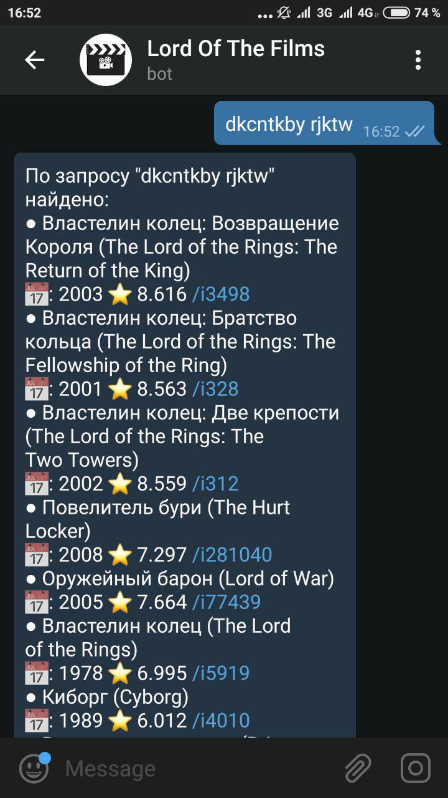
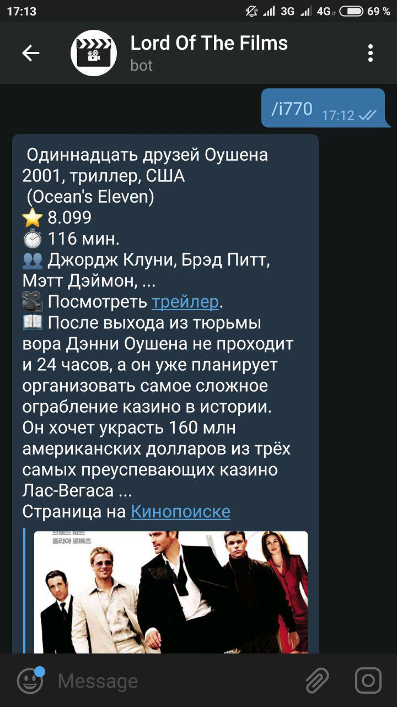
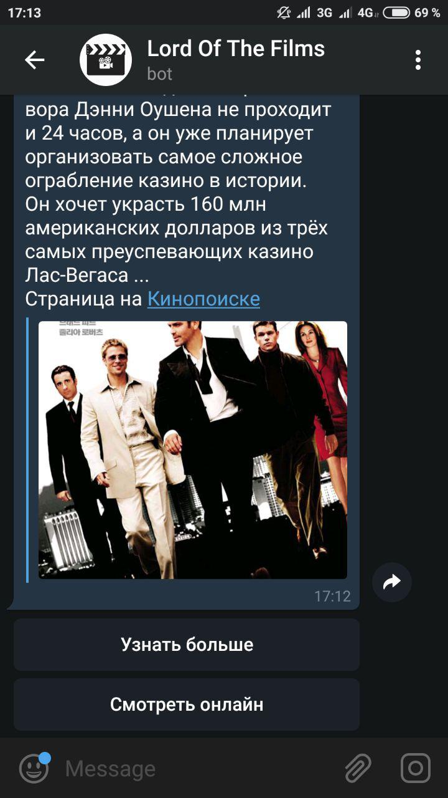
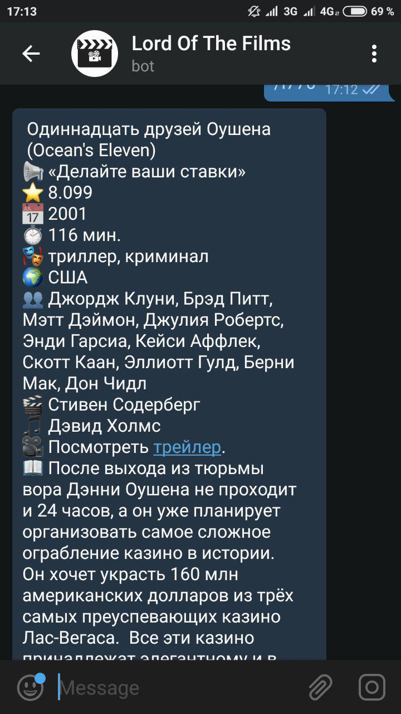
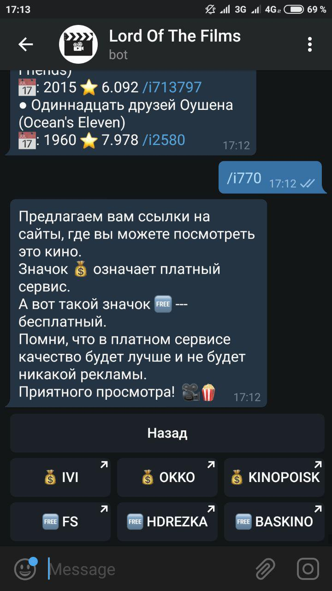
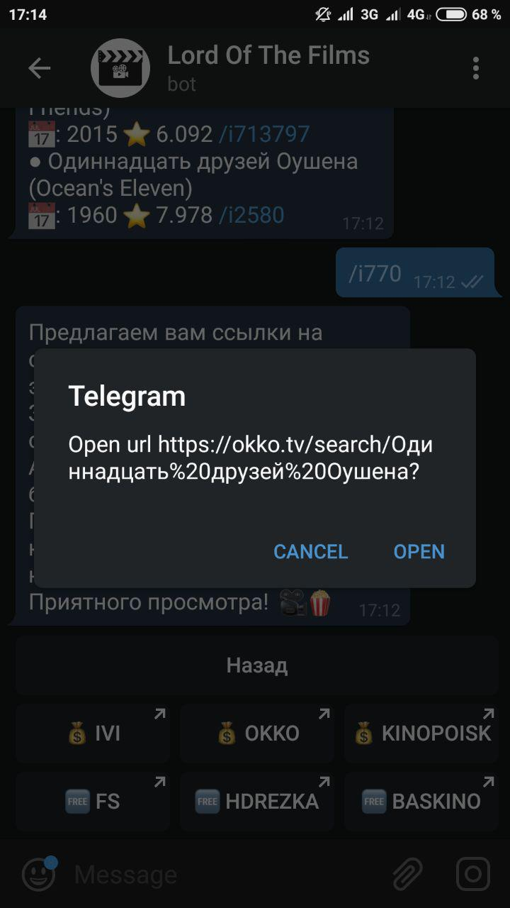

# Cinema Bot

Telegram бот, который поможет вам найти фильмы и сериалы, даст по ним краткую информацию и подскажет, где можно посмотреть их прямо сейчас.

## Что умеет

* Находить название фильма или сериала на английском и русском. Устойчив к опечаткам и неправильной раскладке :D

* Давать краткую и более полную информацию о фильме / сериале вместе с ссылкой на трейлер и страницой на Кинопоиске.

* Предоставлять ссылки на просмотр фильма онлайн на платных и бесплатных сервисах.

## Примеры:

Вводим название, можно опечататься :)

Или случайно напечатать с неправильной раскладкой

Кликаем на айдишник какого-нибудь фильма

Снизу у поста есть панель, где вы можете выбрать опции:
обновить пост, чтобы узнать больше интересного про фильм или 
получить ссылки на онлайн просмотр.

Более полная информация

Cтранички скачивания

## Используемое API:

* [pyTelegramBotAPI](https://github.com/eternnoir/pyTelegramBotAPI) -- 
API для работы с telegram. Понравилась поддержка proxy в одну строчку и элементарный Async

* [kinopoiskpy](https://github.com/ramusus/kinopoiskpy) -- API Кинопоиска. 
Довольно давно не обновлялось, так что не очень актуально, 
но вся логика парсера была взята оттуда. 
Для корретной работы данного бота необходимо установить версию, представленную выше
(из-за изменений в логике сайта Кинопоиска).